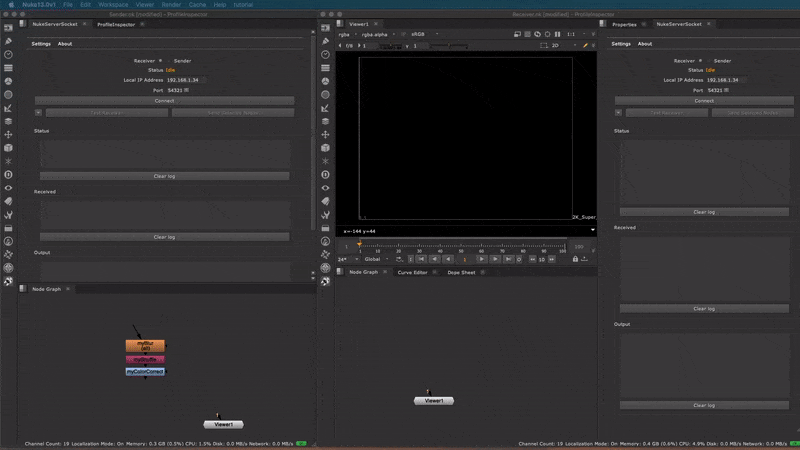

# 1. NukeServerSocket README

A Nuke plugin to run code from external applications.

- [1. NukeServerSocket README](#1-nukeserversocket-readme)
  - [1.1. Features](#11-features)
  - [1.2. Client applications](#12-client-applications)
  - [1.3. Installation](#13-installation)
  - [1.4. Usage](#14-usage)
    - [1.4.1. Execute code](#141-execute-code)
    - [1.4.2. Receive/Send nodes](#142-receivesend-nodes)
  - [1.5. Settings](#15-settings)
  - [1.6. Extendibility](#16-extendibility)
  - [1.7. Test plugin locally](#17-test-plugin-locally)
  - [1.8. Known Issues](#18-known-issues)
  - [1.9. Compatibility](#19-compatibility)

## 1.1. Features

- Receive Python or BlinkScript code from any client in your local network. (More on [Extendibility](#16-extendibility))
- Connect more than one client to the same Nuke instance.
- Receive/Send nodes from another Nuke instance in your local network.
- WebSocket-ready for browser-based text editors.
  > Note: WebSocket connection currently does not work for Nuke 14.

## 1.2. Client applications

Client applications that use NukeServerSocket:

- [Nuke Tools](https://marketplace.visualstudio.com/items?itemName=virgilsisoe.nuke-tools) - Visual Studio Code extension.
- [Nuke Tools ST](https://packagecontrol.io/packages/NukeToolsST) - Sublime Text package.
- [DCC WebSocket](https://marketplace.visualstudio.com/items?itemName=virgilsisoe.dcc-websocket) - Visual Studio Code Web extension.

## 1.3. Installation

1. Download the repository via the [releases page](https://github.com/sisoe24/NukeServerSocket/releases) or by cloning it from GitHub.
2. Place the folder inside the _~/.nuke_ directory or into a custom one.
3. Write `import NukeServerSocket` into your _menu.py_.

NOTES

- If you use a custom plugin path, add the path in your init.py: `nuke.pluginAddPath('custom/path')`
- The folder name must be named **NukeServerSocket**.
- If you use [Nuke Tools](https://marketplace.visualstudio.com/items?itemName=virgilsisoe.nuke-tools), use the command `Nuke Tools: Add NukeServerSocket`.

## 1.4. Usage

### 1.4.1. Execute code

1. Open the NukeServerSocket panel inside Nuke, and with the mode on **Receiver**, start the server by clicking **Connect**.
2. You can now send code from Visual Studio Code with [Nuke Tools](https://marketplace.visualstudio.com/items?itemName=virgilsisoe.nuke-tools) or any other method you prefer.

NOTES:

- You can troubleshoot the connection with the **Test Receiver** button.
- If you receive a message: "_Server did not initiate. Error: The bound address is already in use_", change the **port** to a random number between `49152` and `65535` and try again. It probably means that you have a connection listening on that port already.

### 1.4.2. Receive/Send nodes

- Receive nodes

   When receiving nodes, start the server with the mode on **Receiver**.

- Sending nodes

  1. Switch the mode from **Receiver** to **Sender** and be sure that there is another NukeServerSocket instance listening for incoming network requests.
  2. Select the nodes you wish to send a click **Send Selected Nodes**.

NOTES:

- When sending nodes to the same computer, only the **Port** value must match the two Nuke instances.
- When sending nodes between different computers, both **IP Address** and **Port** must match the two Nuke instances.

## 1.5. Settings

Accessing the settings can be done from the plugin toolbar.

- **Code Execution Engine**: Change the engine that will executing the code.
  - **Nuke Internal**: Nuke `executeInMainThread` function. [**Default**]
  - **Script Editor**: Nuke Script Editor widget.

  > Why use one over the other?
  >
  > - Nuke Internal is a more direct and fast approach, but it uses `exec` under the hood, which might cause some issues.
  > - Nuke Script Editor its a safer approach overall but it does require slightly more work behind scene.

- **Connection Type**: Change the internal connection protocol for the client-server **(Not present in Nuke 14, which defaults to TCP)**.
  - **TCP**: The default type of connection. If unsure, use this. [**Default**]
  - **WebSocket**: This allows a two-way interactive communication session between the user's browser and the internal server. Use this when using a browser-based text editor.

- **Mirror To Script Editor**: Allows mirroring the input/output code to the internal script editor.
  - **Override Output Editor**: Mirror output to the internal script editor.
  - **Format Text**: The script editor output window will receive a formatted version of the code result.
  - **Clear Output**:  The script editor output window will clear the code after each execution.
  - **Show File Path**: The script editor output window will display the full path for the executed file.
  - **Show Unicode**: The script editor output window will display a Unicode character `` that indicates the start of the code execution result.
  - **Override Input Editor**: Mirror input to the internal script editor.

- **Timeout**: Terminate the connection when the Server is inactive or did not establish a successful contact in the time specified.
  - **Server**: Set the Timeout when clicking the **Connect** button. The default value is `10` minutes.
  - **Receiver**: Set the Timeout for when clicking the **Test Receiver** button. The default value is `10` seconds.
  - **Send Nodes**: Set the Timeout when clicking **Send Nodes** button. The default value is `30` seconds.

## 1.6. Extendibility

At its core, the plugin is just a server socket that waits for an incoming request,
performs the operations inside Nuke, and returns the result. Nothing ties it to any application per se.

This makes it very easy to implement a new client, without the need to modify the NukeServerSocket source code. The client needs only to send the data at the specified address inside NukeServerSocket.

You can find more information and examples on the [wiki page](https://github.com/sisoe24/NukeServerSocket/wiki/Create-custom-client).

## 1.7. Test plugin locally

You can run the plugin locally outside the Nuke application. This method is handy for testing code and implementing new features faster.

You can find more information and examples on the [wiki page](https://github.com/sisoe24/NukeServerSocket/wiki/Test-Plugin-locally).

## 1.8. Known Issues

- Nuke 14 does not ship QWebSocket modules so the WebSocket connection not enabled.
- Creating a modal window with the Nuke internal code execution engine will cause Nuke to freeze. A workaround is to switch to the Script Editor engine.
- Settings window doesn't display the tooltip text.
- Changing workspace with an active open connection makes Nuke load a new plugin instance with the default UI state. So it would look as if the previous connection has been closed, whereas in reality is still open and listening. To force close all of the listening connections, you can:
  - Restart the Nuke instance.
  - Wait for the connection timeout.

## 1.9. Compatibility

Nuke version: 11,12, 13, 14

> Because Nuke 11 uses an early version of PySide2, future compatibility is not a guarantee.

While it should work the same on all platforms, I have tested the plugin only on:

- Linux:
  - CentOS 8
- macOS:
  - Mojave 10.14.06
  - Catalina 10.15.07
  - Monterey 12.6.3
- Windows 10
