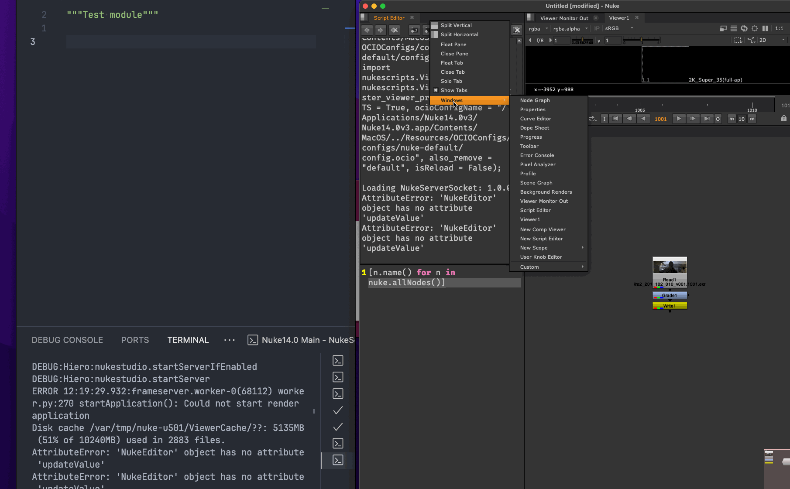

# 1. nukeserversocket README

[](https://github.com/sisoe24/nukeserversocket/releases)
[](https://github.com/sisoe24/nukeserversocket/releases)

[](https://github.com/sisoe24/nukeserversocket/blob/main/LICENSE)

[](https://github.com/sisoe24/nukeserversocket/issues)
[](https://github.com/sisoe24/nukeserversocket/pulls)
[](https://www.codacy.com/gh/sisoe24/nukeserversocket/dashboard?utm_source=github.com&amp;utm_medium=referral&amp;utm_content=sisoe24/nukeserversocket&amp;utm_campaign=Badge_Grade)
[](https://www.codacy.com/gh/sisoe24/nukeserversocket/dashboard?utm_source=github.com&utm_medium=referral&utm_content=sisoe24/nukeserversocket&utm_campaign=Badge_Coverage)


[](https://marketplace.visualstudio.com/items?itemName=virgilsisoe.nuke-tools)


A Nuke plugin to run code from external applications.

- [1. nukeserversocket README](#1-nukeserversocket-readme)
  - [1.1. 1.0.0 Release](#11-100-release)
  - [1.2. Features](#12-features)
  - [1.3. Client applications](#13-client-applications)
    - [1.3.1. Create a custom client](#131-create-a-custom-client)
  - [1.4. Installation](#14-installation)
  - [1.5. Usage](#15-usage)
  - [1.6. Settings](#16-settings)
  - [1.7. Known Issues](#17-known-issues)
  - [1.8. Compatibility](#18-compatibility)
  - [1.9. Contributing](#19-contributing)

## 1.1. 1.0.0 Release

This is the initial stable version of nukeserversocket. It's a total rewrite of the earlier version with the primary goal to enhance stability and simplify maintenance. Now, the plugin is more flexible and straightforward to use in different applications.

For a full list of changes, see the [CHANGELOG](https://github.com/sisoe24/nukeserversocket/blob/main/CHANGELOG.md)

>[!IMPORTANT]
> The repository name has changed from `NukeServerSocket` to `nukeserversocket`. Although GitHub url seems to be case insensitive, if you have cloned the repository before, you might need to update the remote url.
> ```bash
> git remote set-url origin https://github.com/sisoe24/nukeserversocket.git
> ```

>[!NOTE]
>If you are using Nuke 12 or Python 2.7, you can still use the previous version of the plugin `<=0.6.2` from the [releases page](https://github.com/sisoe24/nukeserversocket/releases/tag/v0.6.2)
---

## 1.2. Features

- Receive Python or BlinkScript code from any client in your local network.
- Connect more than one client to the same Nuke instance.

## 1.3. Client applications

Client applications that use nukeserversocket:

- [Nuke Tools](https://marketplace.visualstudio.com/items?itemName=virgilsisoe.nuke-tools) - Visual Studio Code extension.
- [Nuke Tools ST](https://packagecontrol.io/packages/NukeToolsST) - Sublime Text package.
- [DCC WebSocket](https://marketplace.visualstudio.com/items?itemName=virgilsisoe.dcc-websocket) - Visual Studio Code Web extension (deprecated at the moment).

### 1.3.1. Create a custom client

You can create a custom client in any programming language that supports socket communication. The client sends the code to the server, which then executes it in Nuke and sends back the result. For more information, see the [wiki page](https://github.com/sisoe24/nukeserversocket/wiki/Client-Applications-for-NukeServerSocket)

## 1.4. Installation

1. Download the repository via the [releases page](https://github.com/sisoe24/nukeserversocket/releases) or by cloning it from GitHub.
2. Place the folder inside the _~/.nuke_ directory or into a custom one.
3. Then, in your _menu.py_, write
     ```python
     from nukeserversocket import nukeserversocket
     nukeserversocket.install_nuke()
     ```

>[!NOTE]
> If you use [Nuke Tools](https://marketplace.visualstudio.com/items?itemName=virgilsisoe.nuke-tools), use the command `Nuke: Add Packages` then select nukeServerSocket.

## 1.5. Usage



1. Open the nukeserversocket panel inside Nuke, and start the server by clicking **Connect**.
2. You can now send code from Visual Studio Code with [Nuke Tools](https://marketplace.visualstudio.com/items?itemName=virgilsisoe.nuke-tools) or any other method you prefer.

>[!NOTE]
> If you receive a message: "_Server did not initiate. Error: The bound address is already in use_", change the **port** to a random number between `49152` and `65535` and try again.

## 1.6. Settings

You can access the settings from the plugin toolbar.

- **Mirror To Script Editor**: Allows mirroring the input/output code to the internal script editor.
- **Format Text**: The script editor output window will receive a formatted version of the code result. The available placeholders are:

  - `%d`: Time
  - `%t`: The code result
  - `%f`: The full file path
  - `%F`: The file name
  - `%n`: A new line

   **Format Text Example**: `%d - %t%n` will output `12:00:00 - Hello World!` in the script editor output window.

- **Clear Output**: The script editor output window will clear the code after each execution.
- **Server Timeout**: Set the Timeout when clicking the **Connect** button. The default value is `10` minutes.

## 1.7. Known Issues

- Changing workspace with an active open connection makes Nuke load a new plugin instance with the default UI state. So it would look as if the previous connection has been closed, whereas in reality is still open and listening. To force close all of the listening connections, you can:
  - Restart the Nuke instance.
  - Wait for the connection timeout.

## 1.8. Compatibility

Nuke version: 13, 14, 15

While it should work the same on all platforms, I have tested the plugin only on:

- Linux:
  - CentOS 8
- macOS:
  - Mojave 10.14.06
  - Catalina 10.15.07
  - Monterey 12.6.3
- Windows 10


## 1.9. Contributing

If you have any suggestions, bug reports, or questions, feel free to open an issue or a pull request. I am always open to new ideas and improvements. Occasionally, I pick something from the [Projects](https://github.com/users/sisoe24/projects/4) tab, so feel free to check it out.
